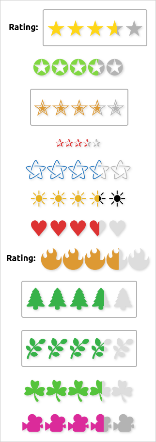
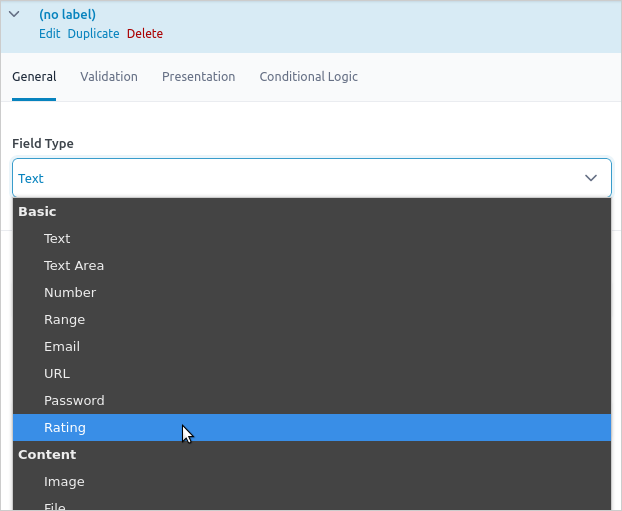
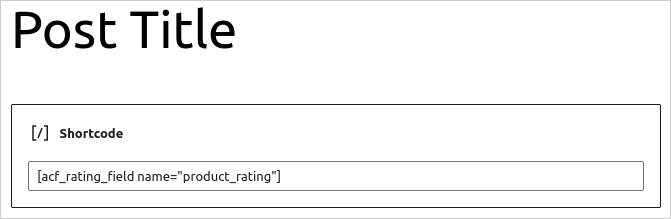

# ACF Rating Field

ACF Rating Field is a Wordpress plugin adding a new ACF field to manage ratings with decimal numbers. The default rating symbol is a star ("★") but it can be customised.

Here are examples for a rating of 3.6 out of 5:

## Installation

- Download the [latest version on GitHub](https://github.com/misaki-web/acf-rating-field/releases/latest/download/acf-rating-field.zip).

- Extract the archive and copy the folder (`acf-rating-field`) to the Wordpress plugins folder (`/wp-content/plugins/`).

- Go to the Wordpress plugins manager on your website (`your-website.ext/wp-admin/plugins.php`) and enable the plugin **ACF Rating Field**. Note that you can enable auto-updates.

## Usage

### Admin

Go to the ACF administration page (`your-website.ext/wp-admin/edit.php?post_type=acf-field-group`), add a new field group and choose the field **Rating**:

Change the field settings as needed.

### Front-end

To display the field value, the shortcode `acf_rating_field` can be used. By default, it'll look at custom fields for the current post where the shortcode is added. For example, the following shortcode:

	[acf_rating_field name="FIELD_NAME"]

is the same as this one:

	[acf_rating_field name="FIELD_NAME" type="post"]

To get the field value from another post, use the attribute `id`:

	[acf_rating_field name="FIELD_NAME" id="POST_ID"]

If the rating field is linked to a user, set the type `user` in the shortcode. By default, it'll look at custom fields for the current user:

	[acf_rating_field name="FIELD_NAME" type="user"]

To specify a specific user, set the attribute `id`:

	[acf_rating_field name="FIELD_NAME" type="user" id="USER_ID"]

## License

ACF Rating Field: Rating field for ACF supporting decimal numbers and custom symbol  
Copyright (C) 2022  Misaki F.

This program is free software: you can redistribute it and/or modify
it under the terms of the GNU General Public License as published by
the Free Software Foundation, either version 3 of the License, or
(at your option) any later version.

This program is distributed in the hope that it will be useful,
but WITHOUT ANY WARRANTY; without even the implied warranty of
MERCHANTABILITY or FITNESS FOR A PARTICULAR PURPOSE.  See the
GNU General Public License for more details.

You should have received a copy of the GNU General Public License
along with this program.  If not, see <https://www.gnu.org/licenses/>.

### Third-party code

- ACF Rating Field uses [Plugin Update Checker](https://github.com/YahnisElsts/plugin-update-checker) under the [MIT License](https://github.com/YahnisElsts/plugin-update-checker/blob/master/license.txt) in order to manage auto-updates in the Wordpress plugins manager.

- Thanks to [ACF Example Field Type](https://github.com/AdvancedCustomFields/acf-example-field-type) for the custom field template.
